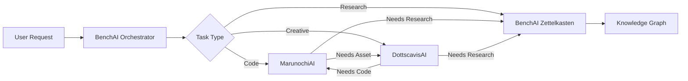

# DottscavisAI Engineer Guide

## Agent Identity
- **Name**: DottscavisAI
- **Role**: Creative Agent
- **Hardware**: M1 Pro Mac 32GB RAM
- **Specialization**: Image generation, video editing, 3D modeling, audio processing, media manipulation

## Connection to BenchAI Orchestrator

BenchAI is running at `http://[BENCHAI_IP]:8085` and serves as the central knowledge repository and orchestrator.

### 1. Register Your Agent

On startup, register with BenchAI:

```python
import httpx
import asyncio

BENCHAI_URL = "http://[BENCHAI_IP]:8085"

async def register_agent():
    async with httpx.AsyncClient() as client:
        response = await client.post(
            f"{BENCHAI_URL}/v1/learning/agents/register",
            json={
                "agent_id": "dottscavisAI",
                "name": "DottscavisAI",
                "role": "creative",
                "capabilities": [
                    "image_generation",
                    "video_editing",
                    "3d_modeling",
                    "audio_processing",
                    "animation",
                    "compositing"
                ],
                "endpoint": "http://[YOUR_IP]:8087"  # Your local endpoint
            }
        )
        print(f"Registration: {response.json()}")
```

### 2. Send Heartbeats

Every 30 seconds, send a heartbeat:

```python
async def heartbeat_loop():
    while True:
        async with httpx.AsyncClient() as client:
            await client.post(
                f"{BENCHAI_URL}/v1/learning/a2a/heartbeat",
                json={
                    "agent_id": "dottscavisAI",
                    "status": "online",  # or "busy", "idle", "rendering"
                    "current_task": "Rendering 3D scene for project X",
                    "capabilities": ["image_generation", "3d_modeling"],
                    "load": 0.8  # 0.0 to 1.0 (GPU utilization)
                }
            )
        await asyncio.sleep(30)
```

### 3. Request Research from BenchAI

When you need creative research or references:

```python
async def request_research(query: str, priority: str = "normal"):
    """
    Submit research request to BenchAI's Zettelkasten.
    Great for: art styles, techniques, references, best practices
    """
    async with httpx.AsyncClient() as client:
        response = await client.post(
            f"{BENCHAI_URL}/v1/learning/research/query",
            json={
                "query": query,
                "agent_id": "dottscavisAI",
                "priority": priority,
                "expand_graph": True,
                "graph_depth": 3,
                "max_results": 15
            }
        )
        result = response.json()
        query_id = result["query_id"]

        # Continue rendering while query processes...
        # Later, retrieve result:
        result_response = await client.get(
            f"{BENCHAI_URL}/v1/learning/research/result/{query_id}",
            params={"wait": True, "timeout": 30}
        )
        return result_response.json()

# Example usage:
research = await request_research(
    "Cyberpunk art style color palettes and lighting techniques",
    priority="high"
)
```

### 4. A2A Task Protocol

Receive tasks from other agents:

```python
from fastapi import FastAPI
from pydantic import BaseModel
from typing import Dict, Any, Optional

app = FastAPI(title="DottscavisAI")

class A2ATask(BaseModel):
    task_id: str
    from_agent: str
    task_type: str
    task_description: str
    context: Optional[Dict[str, Any]] = None
    priority: str = "normal"

@app.post("/a2a/task")
async def receive_task(task: A2ATask):
    """
    Receive creative tasks from other agents.

    Task types:
    - image_generation: Generate images from prompts
    - video_editing: Edit/compose video
    - 3d_modeling: Create 3D models/scenes
    - audio_processing: Audio editing/generation
    - animation: Create animations
    """
    if task.task_type == "image_generation":
        # Queue image generation task
        result = await generate_image(task.task_description)
        return {"status": "completed", "result": result}

    elif task.task_type == "3d_modeling":
        # Queue 3D modeling task
        result = await create_3d_model(task.task_description)
        return {"status": "queued", "estimated_time": "5 minutes"}

    return {"status": "received", "task_id": task.task_id}

# Submit task to MarunochiAI for code help
async def request_code_help(description: str):
    async with httpx.AsyncClient() as client:
        response = await client.post(
            f"{BENCHAI_URL}/v1/learning/a2a/task",
            json={
                "from_agent": "dottscavisAI",
                "to_agent": "marunochiAI",
                "task_type": "code",
                "task_description": description,
                "priority": "normal"
            }
        )
        return response.json()
```

### 5. Memory & Knowledge APIs

Store and retrieve creative knowledge:

```python
# Store a creative memory (technique, style, asset location)
async def remember_technique(content: str, category: str = "creative"):
    async with httpx.AsyncClient() as client:
        await client.post(
            f"{BENCHAI_URL}/v1/learning/memory/store",
            json={
                "content": content,
                "memory_type": "procedural",
                "category": category,
                "importance": 4,
                "source": "dottscavisAI",
                "metadata": {
                    "domain": "creative",
                    "asset_type": "technique"
                }
            }
        )

# Search for creative references
async def find_references(query: str):
    async with httpx.AsyncClient() as client:
        response = await client.get(
            f"{BENCHAI_URL}/v1/learning/zettelkasten/search",
            params={"query": query, "limit": 10}
        )
        return response.json()

# Record successful creative work
async def record_creative_success(project: str, techniques: str, result: str):
    async with httpx.AsyncClient() as client:
        await client.post(
            f"{BENCHAI_URL}/v1/learning/experience/record",
            json={
                "task": project,
                "approach": techniques,
                "trajectory": [
                    {"action": "conceptualize", "result": "designed concept"},
                    {"action": "create", "result": "generated assets"},
                    {"action": "refine", "result": "polished output"}
                ],
                "domain": "creative",
                "outcome": "success",
                "outcome_details": result,
                "success_score": 0.9,
                "agent": "dottscavisAI"
            }
        )
```

### 6. Discover Other Agents

```python
async def discover_agents():
    async with httpx.AsyncClient() as client:
        response = await client.get(f"{BENCHAI_URL}/v1/learning/a2a/discover")
        agents = response.json()

        # Find who can help with code
        programmers = [a for a in agents["agents"] if "coding" in a.get("capabilities", [])]
        return programmers
```

## API Endpoints Reference

| Endpoint | Method | Description |
|----------|--------|-------------|
| `/v1/learning/agents/register` | POST | Register your agent |
| `/v1/learning/a2a/heartbeat` | POST | Send heartbeat |
| `/v1/learning/a2a/task` | POST | Submit task to agent |
| `/v1/learning/a2a/discover` | GET | Discover all agents |
| `/v1/learning/a2a/broadcast` | POST | Broadcast message |
| `/v1/learning/research/query` | POST | Submit research query |
| `/v1/learning/research/result/{id}` | GET | Get research result |
| `/v1/learning/memory/store` | POST | Store memory |
| `/v1/learning/memory/search` | GET | Search memories |
| `/v1/learning/zettelkasten/search` | GET | Search knowledge graph |
| `/v1/learning/experience/record` | POST | Record experience |
| `/health` | GET | Health check |

## Recommended Architecture

```
DottscavisAI (M1 Pro 32GB)
├── Local Generation Server
│   ├── Stable Diffusion (MLX optimized)
│   ├── ControlNet / IP-Adapter
│   └── Whisper (audio transcription)
├── Creative Tools Integration
│   ├── Blender Python API
│   ├── FFmpeg for video
│   └── Audio processing libs
├── FastAPI Backend
│   ├── /v1/generate/image - Image generation
│   ├── /v1/generate/video - Video generation
│   ├── /v1/edit/image - Image editing
│   ├── /v1/model/3d - 3D modeling
│   └── /a2a/task - Receive tasks
├── BenchAI Client
│   ├── Heartbeat loop (30s)
│   ├── Research API client
│   └── Memory client
└── MLX Optimization
    └── Apple Silicon GPU acceleration
```

## Recommended Models for M1 Pro 32GB

| Task | Model | VRAM |
|------|-------|------|
| Image Gen | SDXL-Lightning (MLX) | ~8GB |
| Image Edit | InstructPix2Pix | ~6GB |
| Upscaling | Real-ESRGAN | ~2GB |
| Audio | Whisper Medium | ~2GB |
| Video | Stable Video Diffusion | ~12GB |

## Example: Full Integration

```python
import asyncio
import httpx
from fastapi import FastAPI, BackgroundTasks

BENCHAI_URL = "http://192.168.1.100:8085"  # Replace with actual IP

app = FastAPI(title="DottscavisAI")

# Task queue for long-running renders
render_queue = asyncio.Queue()

@app.on_event("startup")
async def startup():
    # Register with BenchAI
    async with httpx.AsyncClient() as client:
        await client.post(
            f"{BENCHAI_URL}/v1/learning/agents/register",
            json={
                "agent_id": "dottscavisAI",
                "name": "DottscavisAI",
                "role": "creative",
                "capabilities": [
                    "image_generation",
                    "video_editing",
                    "3d_modeling",
                    "audio_processing"
                ],
                "endpoint": "http://YOUR_LOCAL_IP:8087"
            }
        )

    # Start heartbeat
    asyncio.create_task(heartbeat_loop())
    # Start render worker
    asyncio.create_task(render_worker())

async def heartbeat_loop():
    while True:
        try:
            queue_size = render_queue.qsize()
            load = min(queue_size / 10, 1.0)  # Calculate load

            async with httpx.AsyncClient() as client:
                await client.post(
                    f"{BENCHAI_URL}/v1/learning/a2a/heartbeat",
                    json={
                        "agent_id": "dottscavisAI",
                        "status": "busy" if queue_size > 0 else "idle",
                        "current_task": f"Rendering ({queue_size} in queue)" if queue_size > 0 else None,
                        "load": load
                    }
                )
        except:
            pass
        await asyncio.sleep(30)

async def render_worker():
    """Background worker for long-running renders."""
    while True:
        task = await render_queue.get()
        try:
            # Process render task
            result = await process_render(task)

            # Notify completion via callback or broadcast
            async with httpx.AsyncClient() as client:
                await client.post(
                    f"{BENCHAI_URL}/v1/learning/a2a/broadcast",
                    params={
                        "message": f"Render complete: {task['id']}",
                        "from_agent": "dottscavisAI",
                        "category": "render_complete"
                    }
                )
        except Exception as e:
            print(f"Render failed: {e}")
        finally:
            render_queue.task_done()

@app.post("/v1/generate/image")
async def generate_image(prompt: str, background_tasks: BackgroundTasks):
    """Generate image from prompt."""
    task_id = f"img-{int(asyncio.get_event_loop().time())}"
    await render_queue.put({
        "id": task_id,
        "type": "image",
        "prompt": prompt
    })
    return {"task_id": task_id, "status": "queued", "queue_position": render_queue.qsize()}

@app.post("/a2a/task")
async def receive_task(task: dict):
    """Receive task from another agent."""
    if task.get("task_type") == "image_generation":
        await render_queue.put({
            "id": task.get("task_id"),
            "type": "image",
            "prompt": task.get("task_description"),
            "from_agent": task.get("from_agent")
        })
        return {"status": "queued"}
    return {"status": "unknown_task_type"}
```

## Creative Workflow Integration



---

*Generated for BenchAI Multi-Agent System - December 2025*
